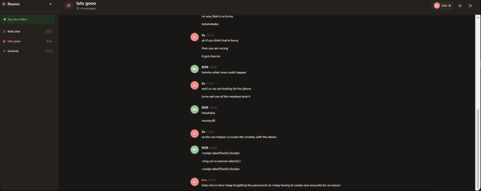
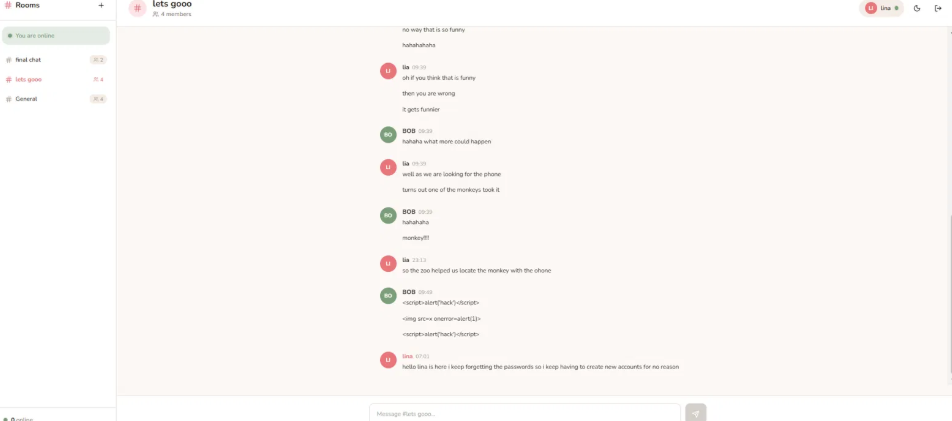
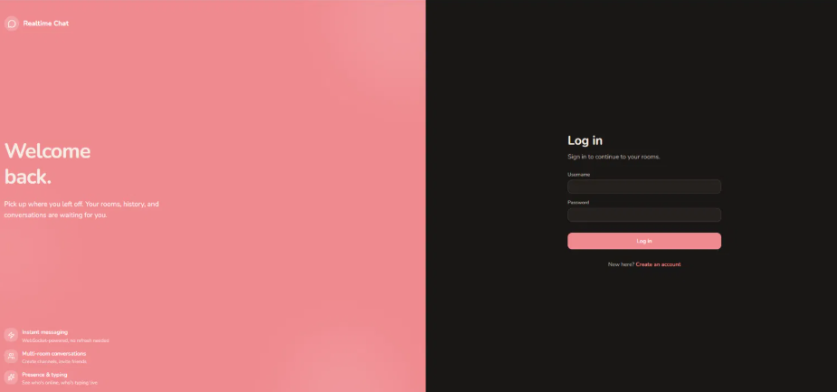
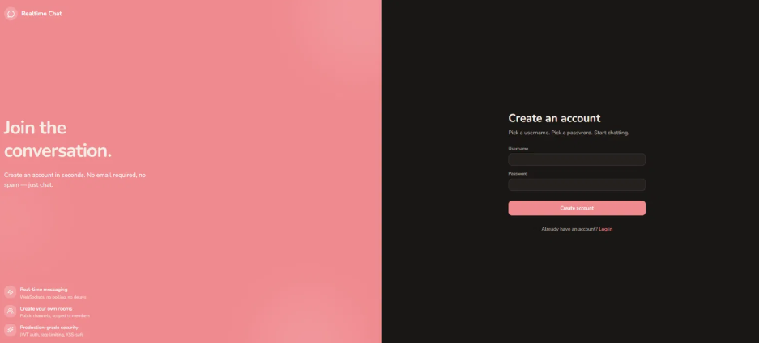

# Realtime Chat

A full-stack multi-room chat application built from scratch to learn modern full-stack patterns. Real-time messaging over WebSockets, JWT authentication, PostgreSQL persistence, presence and typing indicators, and a polished responsive UI with light/dark mode.



## Features

- **Real-time messaging** via Socket.io — push-based, no polling
- **Multi-room conversations** with per-room membership and scoped broadcasts
- **JWT authentication** with bcrypt password hashing (cost factor 12) and 7-day tokens
- **Message persistence** — all messages stored in PostgreSQL with cursor-based pagination
- **Presence tracking** — see who's online across multi-tab sessions
- **Typing indicators** with animated dots, client-side debouncing, and server-side safety cleanup
- **Dark mode** with warm-tone theming, OS preference detection, and `localStorage` persistence
- **Production-grade security** — Helmet, tiered rate limiting, body-size limits, XSS-safe React, parameterized SQL
- **Responsive design** — mobile-first, works from 375px up

## Tech Stack

**Frontend**
- React 18 + Vite + TypeScript
- Tailwind CSS v3 with shadcn-style primitives
- Lucide icons
- Socket.io client
- React Router

**Backend**
- Node.js 22 + Express + TypeScript (ES Modules)
- Socket.io server with JWT-authenticated handshake
- PostgreSQL 18 with `pg` and custom migration runner
- Helmet, express-rate-limit, Zod validation
- bcrypt, jsonwebtoken

## Screenshots

| Chat — Dark mode | Chat — Light mode |
|---|---|
|  |  |

| Login | Register |
|---|---|
|  |  |

## Architecture

Three-layer backend with clear separation of concerns:

```
┌────────────────────────────────────────────┐
│  Route      → validates input, calls...    │
│  Controller → orchestrates, calls...       │
│  Service    → business logic, DB queries   │
└────────────────────────────────────────────┘
```

Real-time messaging uses a **dual-write pattern**: the server persists a message to PostgreSQL first, then broadcasts to all connected clients in that room via Socket.io. Clients optimistically render broadcasts as they arrive, backed by a page of history loaded on room switch.

Socket.io rooms are used as scoping primitives — `socket.join(roomId)` on room entry ensures that broadcasts reach only members of that room, never leaking across.

## Getting Started

### Prerequisites
- Node.js 22+
- PostgreSQL 18+
- npm 10+

### Setup

```bash
# Clone
git clone https://github.com/oumaima-coco/realtime-chat-app.git
cd realtime-chat-app

# Install dependencies (both client and server)
cd server && npm install
cd ../client && npm install
```

### Configure environment variables

Copy the example env files and fill them in with your local values:

```bash
# server/.env
cp server/.env.example server/.env

# client/.env
cp client/.env.example client/.env
```

Edit `server/.env` to point at your local PostgreSQL and set a JWT secret. Generate a secure random secret with:

```bash
node -e "console.log(require('crypto').randomBytes(64).toString('hex'))"
```

### Set up the database

Create a database and user in PostgreSQL, then run migrations:

```bash
cd server
npm run migrate
```

This creates four tables (`users`, `rooms`, `room_members`, `messages`) and a `_migrations` tracking table.

### Run the app

Open two terminal windows:

```bash
# Terminal 1: backend
cd server
npm run dev
```

```bash
# Terminal 2: frontend
cd client
npm run dev
```

Open [http://localhost:5173](http://localhost:5173) — register a new account and start chatting.

## Project Structure

```
realtime-chat-app/
├── server/
│   ├── src/
│   │   ├── config/            Environment loading and validation
│   │   ├── db/
│   │   │   ├── migrations/    SQL migration files
│   │   │   ├── migrate.ts     Custom migration runner
│   │   │   └── pool.ts        PostgreSQL connection pool
│   │   ├── middleware/        Auth, logging, rate limits, error handling
│   │   ├── routes/            Express route definitions
│   │   ├── controllers/       Route handlers
│   │   ├── services/          Business logic layer
│   │   ├── socket/            Socket.io handlers and middleware
│   │   ├── types/             Shared TypeScript types
│   │   └── index.ts           Server entry point
│   └── package.json
│
└── client/
    ├── src/
    │   ├── api/               HTTP client wrappers
    │   ├── components/        Reusable UI components
    │   │   └── ui/            shadcn-style primitives (Button, Input, etc.)
    │   ├── context/           React contexts (Auth, Rooms, Presence, Theme)
    │   ├── hooks/             Custom hooks (useSocket, useTypingIndicator)
    │   ├── pages/             Route components (Home, Login, Chat, etc.)
    │   ├── types/             Shared TypeScript types
    │   ├── lib/               Utility helpers
    │   ├── tokens.css         Design token CSS variables
    │   └── index.css          Global styles + Tailwind directives
    └── package.json
```

## Security

Security hardening applied at multiple layers:

- **Helmet** for security headers (X-Content-Type-Options, X-Frame-Options, HSTS, and more)
- **Tiered rate limiting**: auth endpoints (5 requests / 15 min), write endpoints (20/min), general API (100/min)
- **Body-size limits**: 100kb on both HTTP requests and Socket.io payloads
- **Parameterized SQL queries** everywhere via `pg` — no string concatenation, no injection risk
- **bcrypt** at cost factor 12 for password storage
- **Enumeration prevention** — registration and login return the same error to avoid revealing which usernames exist
- **JWT** with signed tokens, 7-day expiry
- **React JSX auto-escaping** — user-supplied content is rendered as text, never HTML (verified with `<script>` payload tests)
- **CORS** locked to specific origins, not `*`
- **Global error handler** that hides stack traces in production
- **React ErrorBoundary** to prevent crash-page white screens

## What I Learned

Building this project taught me full-stack fundamentals that are hard to pick up from tutorials alone:

- **WebSockets vs HTTP** — when to reach for push-based transports and how to authenticate them via handshake tokens
- **Database design and migrations** — schema design with foreign keys, custom migration tooling, and cursor-based pagination
- **Three-layer architecture** — separating routes, controllers, and services makes the code testable and easy to reason about
- **React context patterns** — when to use context vs prop drilling, and how to compose multiple contexts
- **Design tokens and theming** — CSS variables as the theming layer under Tailwind, giving instant light/dark mode with zero component rewrites
- **Security in depth** — every layer (network, application, database, frontend) has its own concerns
- **TypeScript in practice** — sharing types across frontend and backend, generics, discriminated unions for event payloads

## License

MIT. Feel free to use this as a reference for your own learning projects.